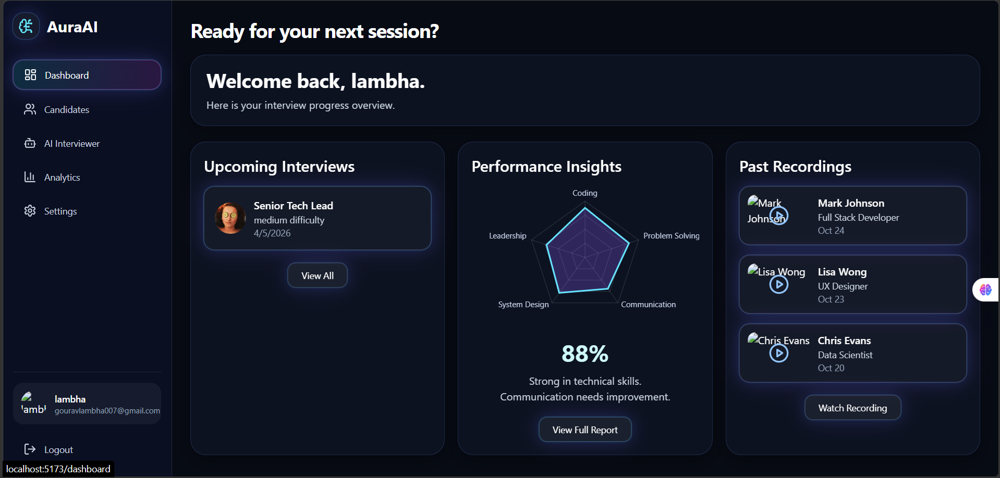
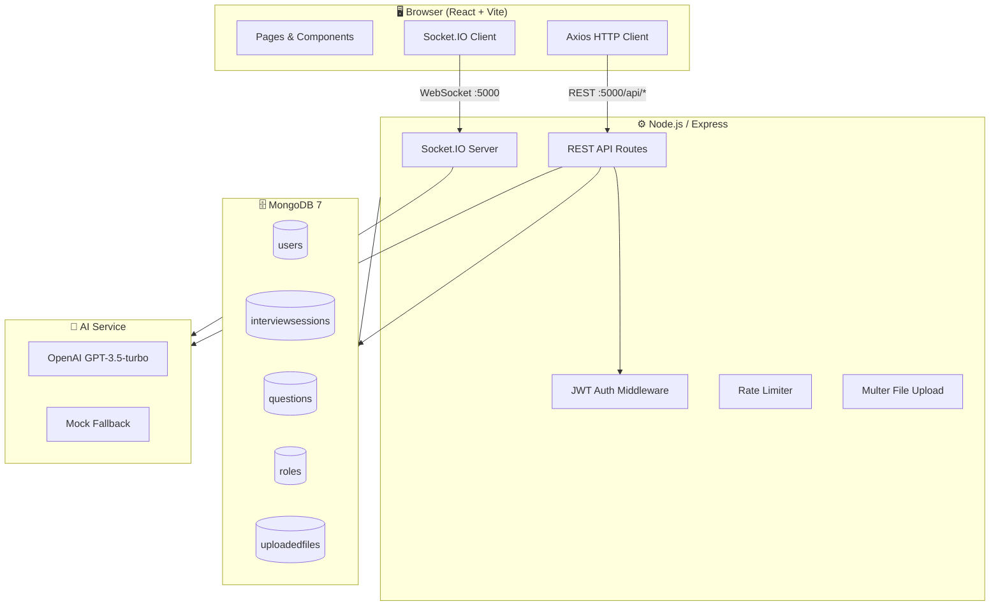
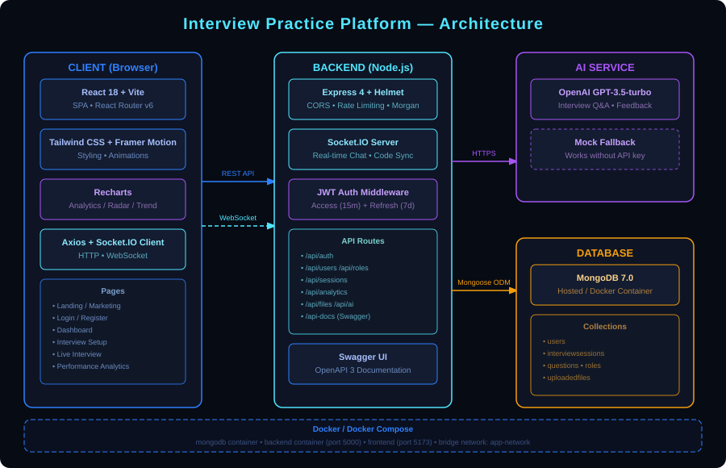
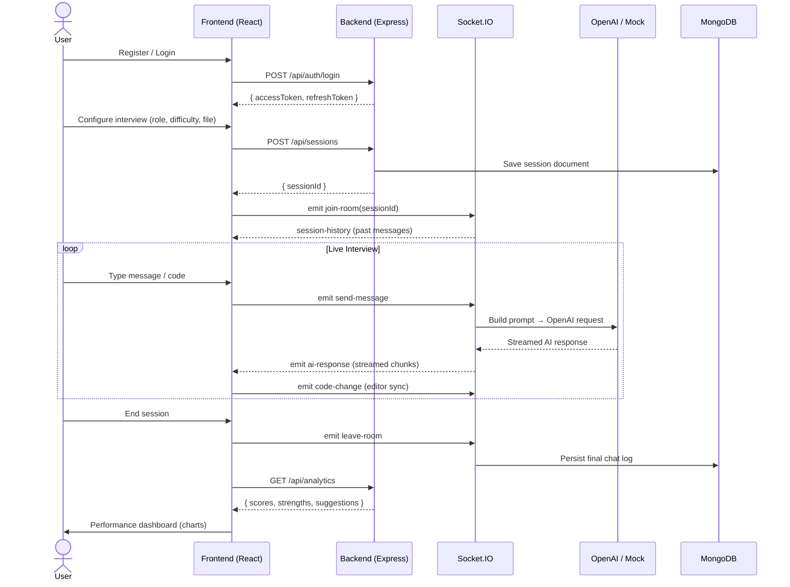
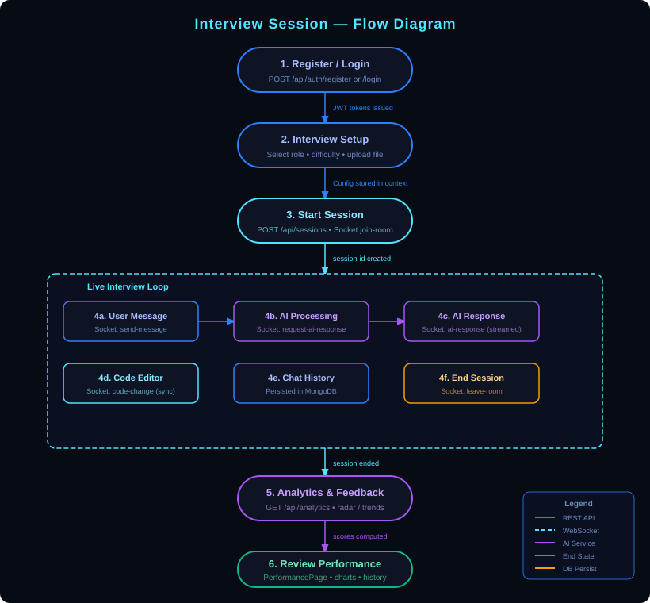

<div align="center">
  ## here is an product
  ## if you want to update 
  ## it is an product
  ## to change anything here here i need some
  ## for the client it will used
  
  <h1>Interview Practice Platform</h1>
  <p><strong>AI-powered mock interviews with real-time feedback, code execution, and performance analytics.</strong></p>

  <p>
    
    
    
    
    
    
  </p>
</div>

---

## 📚 Table of contents
1. [Problem Statement](#-problem-statement)
2. [Key Features](#-key-features)
3. [Tech Stack](#-tech-stack)
4. [Architecture](#-architecture)
5. [Interview Flow](#-interview-flow)
6. [Folder Structure](#-folder-structure)
7. [Prerequisites](#-prerequisites)
8. [Installation & Setup](#-installation--setup)
9. [Running Locally](#-running-locally)
10. [Environment Variables](#-environment-variables)
11. [API Documentation](#-api-documentation)
12. [Testing](#-testing)
13. [Contributing](#-contributing)
14. [License](#-license)
15. [Contact](#-contact)

---

## 🎯 Problem Statement

Preparing for technical interviews is stressful, expensive, and difficult to schedule. Traditional mock-interview platforms are either too rigid, lack real-time feedback, or require another human to participate.

**Interview Practice Platform** solves this by offering:

- 🤖 An AI interviewer powered by OpenAI GPT (or a free mock fallback) that responds naturally in the context of the chosen role.
- ⚡ Real-time collaboration via WebSockets — ask follow-up questions, share code, and receive instant feedback.
- 📊 Multi-dimensional performance analytics so candidates understand exactly where to improve.
- 🔒 A secure, self-hostable stack so teams or individuals can run it with zero vendor lock-in.

---

## ✨ Key Features

| Feature | Description |
|---|---|
| **User Authentication** | JWT access (15 min) + refresh (7 day) token pair with bcrypt password hashing |
| **Live Interview Room** | Socket.IO-powered real-time chat, AI streaming responses, and code editor sync |
| **AI Interview Assistant** | OpenAI GPT-3.5-turbo with context-aware system prompts; automatic mock fallback when no API key is provided |
| **Configurable Personas** | Choose role (e.g., Senior Tech Lead), difficulty (easy/medium/hard), and upload a JD or resume |
| **Integrated Code Editor** | Collaborative coding panel synchronized across the session in real time |
| **Performance Analytics** | Radar chart + trend lines scoring 8 dimensions: Technical Accuracy, Communication, Confidence, Coding, Problem Solving, System Design, Leadership, Overall |
| **File Uploads** | Resume/JD PDF, TXT, DOC uploads up to 10 MB stored and linked to sessions |
| **Swagger API Docs** | Full OpenAPI 3 specification served live at `/api-docs` |
| **Docker Ready** | One-command Docker Compose spin-up for MongoDB + backend |
| **Rate Limiting** | Global (100 req/15 min) and AI-specific (20 req/15 min) rate limits |

---

## 🛠 Tech Stack

### Frontend

| Layer | Technology |
|---|---|
| Framework | React 18.3 + Vite 5.4 |
| Routing | React Router 6 |
| Styling | Tailwind CSS 3.4 + PostCSS |
| Animation | Framer Motion 11 |
| Charts | Recharts 2 |
| Icons | Lucide React |
| HTTP Client | Axios 1.14 (with token refresh interceptor) |
| Real-time | Socket.IO Client 4.8 |

### Backend

| Layer | Technology |
|---|---|
| Runtime | Node.js 20+ (ESM) |
| Framework | Express 4.19 |
| Database | MongoDB 7.0 via Mongoose 8.6 |
| Auth | JWT (jsonwebtoken 9) + bcryptjs |
| Real-time | Socket.IO 4.7 |
| File Upload | Multer 1.4 |
| Security | Helmet, CORS, express-rate-limit |
| Validation | express-validator 7 |
| Logging | Morgan |
| AI | OpenAI 4.57 SDK |
| API Docs | swagger-jsdoc + swagger-ui-express |

### DevOps / Tooling

| Tool | Purpose |
|---|---|
| Docker & Docker Compose | Container orchestration |
| Nodemon | Backend hot-reload in development |
| Jest + Supertest | Backend unit/integration testing framework |

---

## 🏗 Architecturs

The platform follows a **three-tier architecture** with a React SPA on the frontend, an Express REST + Socket.IO backend, and MongoDB for persistence. OpenAI is consumed as an external service.



> **SVG diagram** (for environments without Mermaid rendering):
>
> 

---

## 🔄 Interview Flow



> **SVG diagram** (for environments without Mermaid rendering):
>
> 

---

## 📁 Folder Structure

```
Interview_practics_Plartform/
├── backend/                    # Node.js + Express server
│   ├── Dockerfile
│   ├── package.json
│   ├── .env.example            # Backend environment template
│   └── src/
│       ├── config/index.js     # Centralized env config
│       ├── controllers/        # Route handler logic (auth, ai, analytics, …)
│       ├── middleware/         # auth, error, upload, validate
│       ├── models/             # Mongoose schemas (User, InterviewSession, …)
│       ├── routes/             # Express routers
│       ├── services/
│       │   └── aiService.js    # OpenAI + mock fallback
│       ├── socket/index.js     # Socket.IO event handling
│       ├── swagger.js          # OpenAPI spec definition
│       └── index.js            # Server entry point
│
├── frontend/                   # React + Vite SPA
│   ├── docker-compose.yml      # MongoDB + backend compose file
│   ├── package.json
│   ├── .env.example            # Frontend environment template
│   ├── index.html
│   ├── tailwind.config.js
│   ├── vite.config.js
│   └── src/
│       ├── App.jsx             # Routes definition
│       ├── main.jsx            # React DOM entry
│       ├── assets/
│       ├── components/         # Reusable UI components
│       ├── context/AppContext.jsx  # Global auth + interview state
│       ├── data/mockData.js    # Static fallback data
│       ├── hooks/              # Custom React hooks
│       ├── layouts/            # AppShell, AuthLayout
│       ├── pages/              # LandingPage, Dashboard, LiveInterview, …
│       └── services/
│           ├── api.js          # Axios instance with interceptors
│           └── socket.js       # Socket.IO client factory
│
└── docs/
    └── diagrams/
        ├── architecture.svg    # Architecture overview diagram
        └── interview-flow.svg  # Session flow diagram
```

---

## ✅ Prerequisites

- **Node.js** ≥ 20 LTS
- **npm** ≥ 10
- **MongoDB** 7.x (local install **or** Docker)
- **Docker** + **Docker Compose** _(optional but recommended)_
- **OpenAI API Key** _(optional — a mock fallback is used when not set)_

---

## 🚀 Installation & Setup

### Option A — Docker Compose (recommended)

```bash
# 1. Clone the repository
git clone https://github.com/Gouravlamba/Interview_practics_Plartform.git
cd Interview_practics_Plartform

# 2. Copy and configure backend environment
cp backend/.env.example backend/.env
# Edit backend/.env — set JWT secrets at minimum

# 3. Start MongoDB + backend with Docker Compose
cd frontend
docker-compose up --build -d

# 4. In a separate terminal, start the frontend dev server
npm install
npm run dev
```

The backend will be available at `http://localhost:5000` and the frontend at `http://localhost:5173`.

---

### Option B — Manual (no Docker)

#### Backend

```bash
cd backend
npm install
cp .env.example .env
# Edit .env — at minimum set MONGODB_URI, JWT_SECRET, JWT_REFRESH_SECRET
npm run dev         # development (nodemon)
# or
npm start           # production
```

#### Frontend

```bash
cd frontend
npm install
cp .env.example .env
# Edit .env — set VITE_API_URL if backend is not on localhost:5000
npm run dev         # development server (Vite, port 5173)
# or
npm run build       # production bundle
npm run preview     # preview production build locally
```

---

## ⚙️ Environment Variables

### Backend — `backend/.env`

```dotenv
# ── Server ────────────────────────────────────────
NODE_ENV=development
PORT=5000

# ── Database ──────────────────────────────────────
MONGODB_URI=mongodb://localhost:27017/interview_platform

# ── JWT ───────────────────────────────────────────
JWT_SECRET=change_this_to_a_long_random_string
JWT_EXPIRES_IN=15m
JWT_REFRESH_SECRET=change_this_refresh_secret_too
JWT_REFRESH_EXPIRES_IN=7d

# ── OpenAI (optional — mock fallback used if blank) ─
OPENAI_API_KEY=
OPENAI_MODEL=gpt-3.5-turbo

# ── File Uploads ──────────────────────────────────
UPLOAD_DIR=uploads
MAX_FILE_SIZE_MB=10

# ── CORS ──────────────────────────────────────────
CLIENT_URL=http://localhost:5173

# ── Rate Limiting ─────────────────────────────────
RATE_LIMIT_WINDOW_MS=900000   # 15 minutes
RATE_LIMIT_MAX=100
AI_RATE_LIMIT_MAX=20
```

### Frontend — `frontend/.env`

```dotenv
VITE_API_URL=http://localhost:5000
```

> ⚠️ **Never commit real secrets.** The `.env.example` files are safe templates — copy them to `.env` and fill in your values.

---

## 📖 API Documentation

Interactive Swagger UI is available at:

```
http://localhost:5000/api-docs
```

### Quick Reference

| Method | Endpoint | Description |
|---|---|---|
| `POST` | `/api/auth/register` | Create new account |
| `POST` | `/api/auth/login` | Log in, receive tokens |
| `POST` | `/api/auth/refresh` | Refresh access token |
| `POST` | `/api/auth/logout` | Invalidate refresh token |
| `GET` | `/api/auth/me` | Get current user profile |
| `GET` | `/api/roles` | List available personas |
| `POST` | `/api/sessions` | Create interview session |
| `GET` | `/api/sessions` | List user's sessions |
| `GET` | `/api/sessions/:id` | Get session details |
| `GET` | `/api/analytics` | Get performance analytics |
| `POST` | `/api/files/upload` | Upload resume / JD file |
| `POST` | `/api/ai/insights` | Request AI feedback |
| `GET` | `/api/health` | Health check |

### Socket.IO Events

| Direction | Event | Payload |
|---|---|---|
| Emit → Server | `join-room` | `{ sessionId }` |
| Emit → Server | `send-message` | `{ sessionId, message }` |
| Emit → Server | `request-ai-response` | `{ sessionId, messages, config }` |
| Emit → Server | `code-change` | `{ sessionId, code }` |
| Emit → Server | `leave-room` | `{ sessionId }` |
| Listen ← Server | `session-history` | `{ messages }` |
| Listen ← Server | `new-message` | `{ role, content, timestamp }` |
| Listen ← Server | `ai-response` | `{ chunk }` (streamed) |
| Listen ← Server | `code-update` | `{ code }` |

---

## 🧪 Testing

The backend has **Jest** and **Supertest** configured. No test files are included yet — contributions welcome!

```bash
cd backend
npm test            # runs jest --forceExit
```

> **TODO**: Add unit tests for controllers and integration tests for key API routes.

---

## 🤝 Contributing

Contributions are welcome! Please follow these steps:

1. **Fork** the repository and create your feature branch:
   ```bash
   git checkout -b feature/my-awesome-feature
   ```
2. **Commit** your changes with a clear message:
   ```bash
   git commit -m "feat: add awesome feature"
   ```
3. **Push** to your fork and open a **Pull Request** against `main`.
4. Ensure your code:
   - Passes `npm test` (backend)
   - Does not break existing API contracts
   - Includes documentation updates if you add new endpoints or env vars

### Commit Message Convention

Use [Conventional Commits](https://www.conventionalcommits.org/):

| Prefix | When to use |
|---|---|
| `feat:` | New feature |
| `fix:` | Bug fix |
| `docs:` | Documentation only |
| `refactor:` | Code change without feature/fix |
| `test:` | Adding or fixing tests |
| `chore:` | Build process or tooling changes |

---

## 📄 License

**License: TBD**

No license file has been added to this repository yet. Until one is specified, all rights are reserved by the author. If you intend to use or contribute to this project, please open an issue to discuss licensing.

---

## 📬 Contact

| Role | GitHub |
|---|---|
| Maintainer | [@Gouravlamba](https://github.com/Gouravlamba) |

Feel free to open an [issue](https://github.com/Gouravlamba/Interview_practics_Plartform/issues) for bug reports, feature requests, or general questions.
